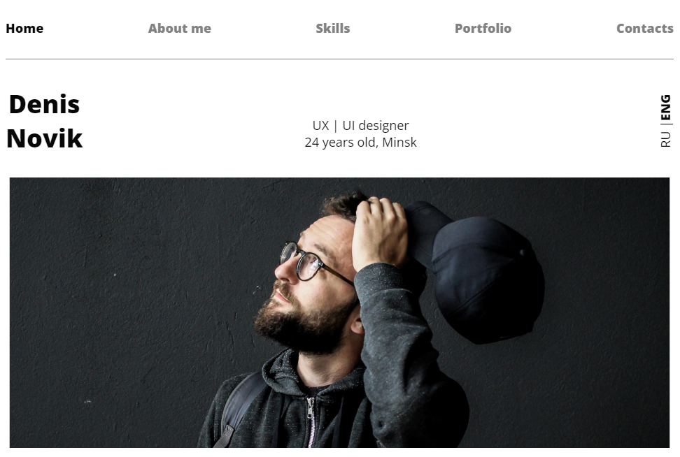

# UI/UX Designer Portfolio Page #

Сайт-визитка UI/UX дизайнера.

Сайт написан на HTML.CSS. В рамках обучения в IT Academy

[Github Pages](https://sergeigolovkin.github.io/denis_novik/)

[Исходный макет на Figma](https://www.figma.com/file/5D9pDuLtS042hzaoN69Kd7/Free--Landing--Page-Template?node-id=254%3A515&t=OcdC0kkJTSqg88wN-0)